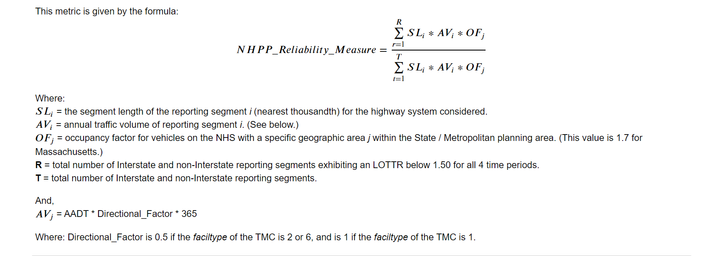

# npmrds-tt-reliability
Repository for tools to calculate NPMRDS level of travel-time reliability (LOTTR) metric for all TMCs in the Boston MPO region.
This repository contains:
* a Jupyter notebook to calcuate the LOTTR metric for all vehicles
* a Jupyter notebeook to calculate the LOTTR metric for trucks

## Methodology
The methodology for calculating the level of travel-time reliabililty (LOTTR) metric 
for all vehicles and for trucks from NPMRDS data is documented in the FHWA document  
[National Performance Measures for Congestions, Reliability, and Freight, and CMAQ Traffic Congestion](https://www.fhwa.dot.gov/tpm/guidance/hif18040.pdf).

In summary, we:
1. Calculate the LOTTR metric for each TMC for each of the 4 (all vehicles) or 5 (trucks) National Highway Performance (time) Periods, and then
2. Caclulate the single MPO region-wide LOTTR metric from \(1\).

The 4 National Highway Performance Program (NHPP) time periods for __all vehicles__ are:  
* Weekdays 6 AM to 10 AM
* Weekdays 10 AM to 4 PM
* Weedkays 4 PM to 8 PM
* Weekends 6 AM to 8 PM

The 5 National Highway Performance Program (NHPP) time periods for __trucks__ are:  
1. weekdays 6 AM to 10 AM
2. weekdays 10 AM to 4 PM
3. weekdays 4 PM to 8 PM
4. weekends 6 AM to 8 PM
5. all days 8 PM to 6 AM

## Inputs
### Required input 1: speed and travel-time data
Travel-time data is downloaded from the NPMRDS Analytics Probe Data Analytics Portal in [RITIS](https://ritis.org).  

The specification of the data to download from RITS for _all vehicles__ is as follows:
* All NPMRDS TMCs in the Boston Region MPO area. This list of TMCs is found in the file __brmpo\_npmrds\_tmcs\_2019.txt__.
* January 1, 2019 through December 31, 2019, from 6:00 AM to 8:00 PM
* With data aggregated in 15 minute units

The specification of the data to download from RITIS for __trucks__ as as follows:
The specification of the data to download from RITS is as follows:
* All NPMRDS TMCs in the Boston Region MPO area. This list of TMCs is found in the file __brmpo\_npmrds\_truck\_tmcs\_2019.txt__.
* January 1, 2019 through December 31, 2019, for the entire day
* With data aggregated in 15 minute units

The user needs to have downloaded this data from RITIS and extracted the CSV file containing speed and travel-time data from teh ZIP archive
delivered by the npmrds-analytics email system.   The location of the CSV file containing speed and travel-time data is specified by
 the variable __ritis\_data\_csv__ in each Jupyter notebook.

### Required input 2: DBF file containing attribute table for NPMRDS shapefile
The location of this input is given by the variable __tmc\_attr\_table\_dbf__ in each Jupyter notebook.

## Outputs
Each notebook produces two outputs:
1. A CSV file with the LOTTR metric calculated for each TMC; the location of this file is specified by the variable __output_csv_fn__ in each Jupyter notebook.
2. The single, region-wide LOTTR metric is reported in the last cell of the notebook.

### Region-wide LOTTR Metric
The formula for the single, region-wide LOTTR metric for all vehicles is:
</img>

The formula for the single, region-wide LOTTR metric for trucks is:
</img>